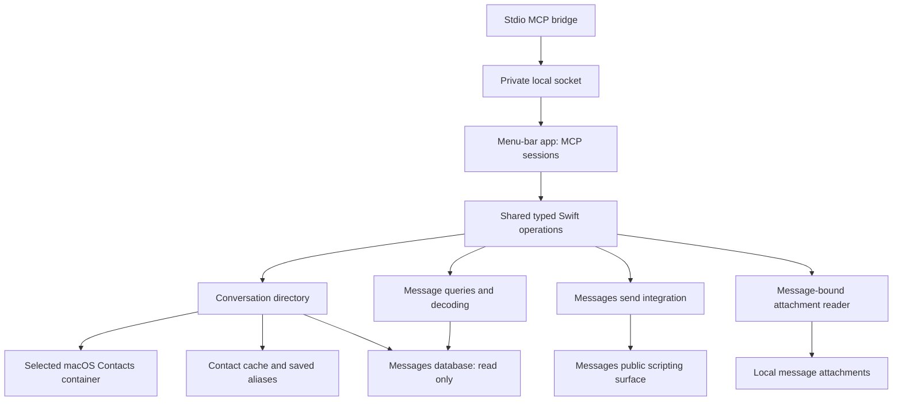

# Architecture

## Shared Swift operations

The primary agent interface is stdio MCP connected to a native menu-bar app over a private local socket. The app owns the shared Swift operation layer. The layer owns contact joins, conversation identity, aliases, queries, decoding, state and sending. Transport adapters parse and validate their input, invoke typed operations and present results.



The menu-bar app owns Contacts permission, selected-container settings, one operation actor, one Messages database connection and one state writer. Each agent connection has a separate MCP session using the same operations. The stdio bridge frames MCP messages over a user-private Unix socket; it does not execute operations or replay operation requests. No TCP listener or separate system service is required. The core has no menu, terminal-output or approval-dialog dependency.

Use the official Swift MCP SDK for the adapter after verifying compatible pinned versions. Tool descriptions and schemas should be compact and explicit. Deferred tool discovery is client-dependent and is a validation question, not a reason to assume every schema is always in context.

## Conversation directory

The directory joins chat records with names from the selected Google Contacts account and local thread aliases before returning results. Google Contacts is the upstream authority; its user-selected macOS Contacts container is the accepted access layer, using normal system synchronization. The display-label order is saved alias, native thread name, then participant names; native name and participants remain visible alongside the label.

Person lookup expands contact handles; conversation lookup matches membership. A request for a conversation with a person must include the other participants' messages, not only rows sent by that person. Missing and ambiguous names are distinct results.

Keep aliases as durable user-owned records associated with stable chat identity. Contact information and frequent-contact rankings are disposable cache data. Cache refresh must not delete aliases or undo a just-written alias. A missing chat must not cause its alias to bind silently to another thread.

Two atomic JSON files hold local state: contacts.json contains the disposable FIFO cache, and aliases.json contains GUID-keyed user aliases. Their versioned schemas and private path are described below. Keep runtime state outside the repository. Do not inject the complete directory into each model prompt; return the relevant enriched records.

Cache data supports discovery and display. Resolve the current destination and participants before presenting a send preview. A cached label alone is not a write destination.

Use a user-confirmed Google-backed Contacts container with non-unified fetches and device-local contact IDs. The public container API does not prove the Google login behind a display label, so selection is an explicit setup action. Cache refresh reads the Mac’s synchronized values; it does not force an upstream Google sync. The owner accepts ordinary sync freshness. Google server IDs and a direct Google connection are not needed. A missing container requires reselection rather than silent rebinding. Source-isolation and lookup performance remain integration checks.

## Message integration and upstream reuse

Open Apple's Messages database read-only. Resolve contact names through the selected Google-backed macOS Contacts container and existing synchronization. No direct Google adapter or OAuth setup is part of this implementation. Use the public Messages scripting surface for supported sends. Initial OS permission setup is separate from the conversational approval policy in [requirements](requirements.md#reading-drafting-and-sending).

The reviewed imsg source exposes an in-process `IMsgCore` library and x86_64 builds. Its decoding, schema and attachment code and tests are useful references. Reuse only the needed public components; do not enable its injected helper or private-framework operations.

The following differences require implementation work rather than a cosmetic adapter:

- imsg's forward ROWID catch-up cursor is not backward, newest-first history continuation.
- Its history participant filter matches senders, not a conversation's participant set.
- Its daily statistics do not supply arbitrary partial-day range counts or the full ranked calendar-bucket contract.
- Enriched name resolution, saved aliases and the bounded frequent-contact cache are this project's operation layer.
- Multiple-file sends require clear partial outcomes; incoming image/file presentation is owned by the attachment reader and MCP adapter.

The preparatory build and query probe support a narrow maintained adaptation of the public read/query/decoding code: required connection and decoder seams are internal, so an external wrapper cannot supply the complete contract unchanged. Keep the adaptation small and omit unneeded CLI/private-helper code. Do not fetch complete history through a public API merely to emulate missing filters or continuation. Preserve applicable upstream license notices and test expectations.

## Incoming attachments

The attachment reader resolves IDs through the SQLite message/attachment join,
then opens the source with descriptor-relative, no-symlink path traversal. It
checks and reads the same regular-file descriptor with explicit byte limits.
ImageIO decodes and renders a bounded first-frame PNG; original file retrieval
preserves complete bytes. The operation actor owns retrieval, and the MCP adapter
adds image or embedded-resource content alongside structured metadata. No file
content enters contact/alias state or a durable generic cache. Exact limits,
metadata and failures are defined in [schemas](schemas.md#incoming-attachment-retrieval).

## Approval ownership

Agent guidance implements draft-versus-send intent and the exact-preview policy. The client approves the invocation. The core checks destination and file arguments and reports the send result honestly. This project does not copy OpenAI's private read/send permission stores or invent a model-set confirmation flag as evidence of consent.

Verify the normal host flow with an inert operation before enabling real sends. If the client's behavior differs from the intended flow, record the observed gap rather than adding a second approval system without a decision.

## Simplicity and performance

The tested search direction is one streaming scan, shared searchable-text resolution before full record construction, and native Foundation matching under an explicit whole-Character policy. Profiling identified case-insensitive matching as the dominant remaining cost; attributed-body parsing was a small fraction. The preferred policy prototype completes the controlled 100,000-message workload in about 1.1 seconds without a persistent body index. It corrects a reproduced false match in the old path and is not certified bug-for-bug equivalent. The [matching-policy decision](decisions.md#search-matching-policy) remains explicit; [validation](validation.md#search-profiling-and-matching-policy-experiment) records tests, timings and limits. Production code still needs the shared message model, source integration and live verification.

The people cache uses FIFO eviction and refreshes records daily or on use, whichever is sooner. Refresh and eviction order are separate: an existing record's refresh does not move it to the back of the queue under the accepted interpretation. Keep user aliases immediately consistent and independent of cache refresh/eviction. A process may retain hot lookups while connected to MCP, but persistence must also work across process restarts. The menu-bar app owns daily refresh while active and overdue refresh at startup.

## Activity queries

Activity streams distinct source coordinates and classification metadata from a
read-only SQLite snapshot. It does not decode message bodies or fetch truncated
history pages. The shared source classifier separates user messages from events;
activity excludes retracted user messages while history preserves their markers.
SQL deduplicates message rows overall and message/chat coordinates per chat.

The operation reuses participant resolution, membership predicates and chat
names. Calendar boundaries use the resolved Gregorian timezone. Sparse bucket
counts determine whole-range chat ranking; zero rows are produced for the selected
page rather than materializing a complete chat-by-calendar grid.

Continuation preserves integer date bounds and arrival fences for messages,
chats and both association tables. A SHA256 digest covers every sparse count,
ordered chat coordinate and interval before page slicing. Changed aggregates
require restart; unchanged body edits can continue. The digest validates count
pagination, not individual-message identity or a historical snapshot. The
[activity schema](schemas.md#activity) owns input precision and result details.

## Runtime setup

The package contains the shared `MessagesCore` library, `MessagesMCPAdapter`,
a native `Messages Swift` menu-bar app and the `messages-mcp` stdio bridge.
The app uses the system SQLite and Contacts libraries and pinned Swift MCP SDK
0.12.1. Synthetic test executables remain separate from production.

Install locally from the checkout:

```sh
./scripts/install-menu-app.sh
open "$HOME/Applications/Messages Swift.app"
```

The installer builds release binaries and signs the app locally. Set
`MESSAGES_SWIFT_SIGNING_IDENTITY` to a usable certificate identity to sign updates
consistently. Otherwise it reads the local certificate choice from
`~/Library/Application Support/messages-swift/signing-identity`; if neither is
configured it uses ad-hoc signing whose identity changes with the build. The
local identity file contains only a certificate identifier, never a password. Quit the app
before updating. The app has its own Contacts and Automation usage declarations and entitlements;
macOS still requires the user's permission. Signing does not grant access.
Launch the app normally through Finder or `open`; invoking its nested executable
from Codex does not establish an independent permission identity on the tested Mac.

Settings shows Contacts and Automation permission alongside Messages database readability.
The window opens on launch when required access or a source selection is missing.
Choose Set Up Permissions to request Contacts access through the native async API,
then Automation access through the public Apple Events permission API. Permission
checks and requests that can block run off the main actor. Missing Automation
permission blocks sending, while the existing read runtime remains available.
Setup opens the appropriate System Settings pane for missing access. Full Disk
Access requires a manual user grant: the app opens that pane and reveals itself
in Finder so it can be added if absent. The file check reports readability,
permission denial, missing files or other failures; it does not assert a global
Full Disk Access grant or replace the runtime's SQLite/schema validation.

Check Again and returning from System Settings refresh the displayed status
without requesting permission again or repeatedly opening settings panes.
Concurrent setup clicks share one pending Contacts request. Denied Contacts
access routes to its settings pane; restricted access is explained. Select the
already-synchronized account and save. Selection is explicit: a container display
name does not establish Google account ownership. A saved source change takes
effect after quitting and reopening the app. Existing failed/active runtimes are
not replaced by overlapping state writers. No account, synchronization, privacy
database or client signature is changed by setup. This reading build requires
Contacts and Messages file access; other permissions belong to the features that
actually require them.

Settings saves private configuration at
`~/Library/Application Support/messages-swift/config.json`. The required
`containerID` is device-local. Optional absolute `databasePath` and
`stateDirectory` override `~/Library/Messages/chat.db` and
`~/Library/Application Support/messages-swift`. Unknown keys and relative paths
are rejected. Real container IDs belong only in private setup.

The app publishes `~/.messages-swift/runtime/mcp.sock` for local clients. The
private runtime directory is 0700 and socket 0600. Both ends validate the peer's
user identity. Each connection carries the existing newline-delimited MCP
protocol with an independent session; all sessions use one shared operation actor.
The bridge reports an unavailable app rather than starting another state owner or
replaying a request. Stdout contains MCP only; stderr messages exclude private data.

Register the installed bridge through the client's supported MCP configuration.
For Codex:

```sh
codex mcp add messages-swift -- "$HOME/Applications/Messages Swift.app/Contents/MacOS/messages-mcp"
```

A new client session is required to verify discovery. Registration alone does not
prove a live read. All ten registered tools use the shared operations; live
validation gates are recorded in [validation](validation.md).

### Private ChatGPT tunnel

For the owner's private ChatGPT connector, `scripts/install-private-tunnel.sh`
uses the installed app and its existing `messages-mcp` bridge as the sole local
Messages, Contacts, cache and socket owner. The OpenAI tunnel client starts that
bridge over stdio; it does not add an HTTP server, Go gateway or second Swift
operation process. The generated profile uses only
`env:CONTROL_PLANE_API_KEY`, with a loopback ephemeral health listener.

Installation takes an explicit tunnel ID and tunnel-client path. The caller
provides `CONTROL_PLANE_API_KEY` through its environment; the installer stores
it mode 0600 in `~/Library/Application Support/messages-swift/private-tunnel/`
and never places it in a plist, command argument, profile or log path. The
runtime reads that one file without shell-sourcing it, supplies the key only to
the tunnel client, and removes `CONTROL_PLANE_API_KEY` and `OPENAI_API_KEY`
before executing the bridge.

Two user LaunchAgents provide the limited persistence: the tunnel client and
`/usr/bin/open -g -W "$HOME/Applications/Messages Swift.app"`. Both run at load,
restart with a 30-second throttle and keep no extra state owner alive. While
enabled, quitting Messages Swift is supervised and it reopens. Run
`scripts/uninstall-private-tunnel.sh` to stop and remove only these jobs; it
preserves the runtime key unless `--delete-key` is supplied explicitly.

`scripts/private-tunnel/private-tunnel-service.sh` starts or stops only those
two jobs and preserves their plists, profile and key. During a later
`install-menu-app.sh` update, it pauses only the app supervisor, terminates the
installed app, replaces the bundle and resumes supervision even if the update
fails. A normal app install remains unchanged when the private service is absent.

### Connection recovery after an app restart

The stdio bridge remains available when the app disconnects. It discards incomplete
backend JSON and returns a JSON-RPC error for each outstanding request. Error
data reports `not_submitted` when no request bytes were written, including a
failed connection or initialization. Once bytes were written, it reports
`outcome_unknown`: a send may have executed before its response was lost. No
operation request is replayed.

A new request makes one connection attempt. If the prior session initialized,
the bridge first repeats that initialization and sends `notifications/initialized`
to the new backend. It releases the new request only when the negotiated protocol
version and capabilities still match. A failed connection, failed handshake or
five-second handshake timeout fails that request; a later request can try again.
Ordinary notifications and client responses are discarded while disconnected or
restoring, even when a new request is queued. They cannot cross into a different
backend session. Restoration becomes ready only after its initialized notification
is fully written. No timer reconnects an idle session.

| Connection state | Event | Result |
|---|---|---|
| Disconnected | New request | One connect attempt; restore initialization when previously negotiated |
| Disconnected | Notification or client response | Discard; no connection attempt |
| Restoring | Matching initialization response | Send initialized notification, then uncancelled queued work once |
| Restoring | EOF, write failure, mismatch or timeout | Close backend; fail pending request; become disconnected |
| Connected | Complete response | Forward complete JSON and retire its request ID |
| Any | Client cancellation | Remove queued or wholly unwritten request; forward cancellation only if request bytes were written; retire its ID |
| Connected | EOF or I/O failure | Discard incomplete backend frame and unsent bytes; fail all pending IDs; become disconnected |
| Any | Client stdin EOF or output failure | Exit and close the owned socket |

Complete client controls are processed before backend writes. A cancellation can
remove a request waiting for restoration even when ordinary queued requests
precede it. A cancelled, unwritten request never reaches the app; cancellation
after writing remains best effort and does not imply a send was undone.

Only initialization survives backend loss. Complete response frames already
received remain deliverable; partial frames cannot contaminate the next response.
The bridge bounds a JSON frame at 32 MiB, preserving attachment responses whose
8 MiB source bytes expand past 11 MiB in JSON. Input/output backpressure bounds
buffer growth; outstanding IDs belong only to their original backend connection.

Replacing the installed executable does not update a bridge process already
running in a client. A client using the old binary needs one fresh stdio MCP
session after installation. Initialize that session and rediscover its tools.
Re-registering configuration alone does not establish a new session. An already
closed host transport cannot be revived by the bridge; use the host's supported
fresh-session flow in that case.

An interrupted send remains uncertain until its source state is inspected. Never
replay it merely because a new session connected. An app restart also invalidates
store-bound cursors: start a new bounded read rather than reusing them. A resumed
watch starts from its new baseline and does not claim coverage of the disconnected
interval; inspect that interval with a bounded history read when needed.

`contacts.json` is version 1 with `containerID`, `isSeeded` and FIFO `entries`;
each entry carries `person` (source identity, display name, handles), `admittedAt`
and `refreshedAt`. `aliases.json` is version 1 with a `chat.guid`-to-name map.
Internal dates use Foundation's Codable reference-date seconds. Cache replacement
or source reselection does not replace the alias file. Unsupported versions and
malformed state fail rather than being silently reset. New state directories use
0700 and state files 0600. The app is the sole state writer; independent MCP sessions share it. Do not run a separate operation process against the same state directory.

First population ranks the selected source's people over the preceding 90 days.
A one-member conversation credits its counterpart for sent and received source
rows. A multi-member conversation credits only the actual incoming author;
outgoing group rows give no passive member credit. Repeated associations to the
same handle credit a source row once; a person's score sums its handle scores. This cache-baseline rule is separate from the activity-count normalizer. Current membership cardinality is used;
no display-name/routing-string guess distinguishes a residual one-member group.
Later admission evicts the earliest entry at 100 people; refresh preserves order.

Operations batch used-contact writes. Exact reads and alias lookup query an exact
chat GUID; search enriches only returned/diagnostic-example chat GUIDs. Name
discovery may inspect all candidates. Participant and unread joins are batched
rather than fetched once per unrelated chat.

Warm contact reads use non-unified email/phone predicates against the local
Contacts index. Candidate requests include the identifier and the matching email
or phone field required by the native predicate. The matching values are transient:
the operation immediately retains only IDs, checks each candidate's selected
container, then fetches named person details. Unselected candidates never become
named results or cache entries. All selected candidates
are retained, including uncached shared-handle owners. Phone matching is documented
best effort. One exact normalized selected-source owner retains its joined name
and identity on warm reads. Approximate-only or multiple exact owners remain
unresolved; candidate entries include their requested handle and match type. This avoids application
full-container enumeration in the warm candidate path, but does not prove native
index performance or complete phone-normalization equivalence. Full name discovery
still enumerates the selected container. The API sequence is not an atomic Contacts
snapshot; linked/removed IDs and native matching require the live proof gate.

On startup and once per minute while active, the server checks for contacts from
an earlier local calendar day and refreshes them. Every use refreshes the selected
contact's synchronized values even within the same day. Failed refreshes do not
mark records fresh. The menu-bar app owns this schedule for all connected clients.

`ApplicationRuntime` is the production composition used by the menu-bar app: it opens the read-only SQLite store, constructs local state, refreshes on startup, and owns periodic refresh for the app lifetime. Tests supply a clock, selected-source
adapter and runner at this same dependency boundary; production has no test flags.

A MessageStore owns one lazy, persistent read-only SQLite connection and serializes
its per-call read transactions. Cursors carry that connection's instance identity,
exact source nanoseconds, message and chat row coordinates, immutable filters and
an arrival fence. There is no stat-before-open identity claim and no reopen by
pathname. SQLite's HAS_MOVED result is checked before/after each read; errors fail
closed. Normal WAL access keeps the original SQLite pathname. An app restart creates a new store and rejects old cursors, even if pointed at the same file; reconnecting an MCP client to the same running app preserves the store identity. GUID aliases remain durable.
This is append-stable continuation, not a historical snapshot through edits,
deletions or membership changes.

## Send execution

`MessagesOperations.sendMessage` resolves the selected Contacts source and exact
destination, validates the complete local-file batch and dispatches text followed
by files through `MessagesSending`. The shared actor rejects overlapping send
batches while allowing read operations during the asynchronous scripting call.
The [schema](schemas.md#sending) owns the per-part and aggregate outcomes.

`resolveSendRoute` uses the same resolver before preview. Its public AppleScript
account query reads enabled iMessage/SMS/RCS accounts only; it does not probe a
recipient or dispatch a message. On September 9, 2026, the extracted query ran
read-only on the Intel host and returned iMessage and SMS.

`MessagesScriptingSender` executes fixed public AppleScript handlers in-process
using `NSAppleScript` and Apple Event string arguments. User text, paths, handles
and IDs never become executable source. Blocking permission checks and script
execution run off the main actor. A nonprompting public Automation check gates
execution; setup owns the user permission request. Exact chat lookup and operation-selected
individual service selection precede the send command. The operation defaults to
available route history, then SMS/iMessage eligibility for a phone; an explicit
service remains an advanced override. One alternate eligible service is allowed only after the scripting
handler reports a route lookup failure before dispatch. Attempt snapshots live
only in the result, and successful parts are not replayed. Errors after dispatch
begins are conservatively unknown and never retried.

The scripting reply supplies no message ID. The operation observes a bounded
post-dispatch window and returns a source-row ID only when one candidate matches
the destination, service family and decoded text or staged path. The result labels
that inference and separates source sending and delivery flags. Competing or
missing candidates remain unknown. `StagedOutgoingFiles` prepares the whole file batch
under the app-owned `Library/Messages/Attachments/messages-swift` directory before
any dispatch. This gives imagent a Messages-readable path instead of the caller's
repository/Desktop path. Private per-batch/per-index directories retain original
filenames; descriptor-based copies bind each staged snapshot to the validated source identity.
Only accepted/uncertain file inputs outlive the invocation; unhanded files are
removed. No TTL or sweep assumes Messages has finished reading after its reply.
This is transfer-input ownership, not a receipt store or a delivery guarantee.
Drafting and approval remain in the agent/client guidance.


## Active-session watch

The shared operation polls read-only association arrivals in bounded batches,
suspending on a monotonic clock between snapshots. Waiting releases the operation
actor so other reads and separate clients can proceed. The MCP adapter owns
request cancellation and session cleanup. No timer survives its request.
Association ROWID ordering preserves late chat joins independently of message
ROWID and source date. Cursors carry one connection-bound anchor and no global
acknowledgment state. The exact scope, limits and unobserved mutations are in
[the watch schema](schemas.md#active-session-incoming-watch).
