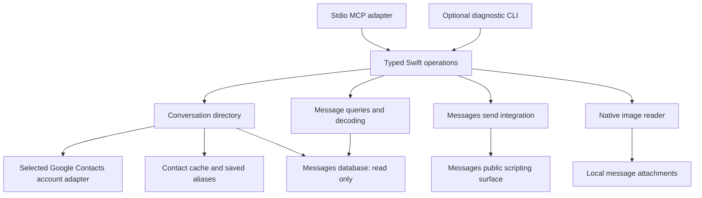

# Architecture

## Shared Swift operations

The primary agent interface is stdio MCP over a native Swift operation layer. The layer owns contact joins, conversation identity, aliases, queries, decoding, state and sending. Transport adapters parse and validate their input, invoke typed operations and present results.

One local executable can host MCP for the client session. It does not require a system service or a network listener. A CLI, if added, calls the same operations in-process and does not introduce a second cache or query implementation. The core has no MCP, terminal-output or approval-dialog dependency.

Use the official Swift MCP SDK for the adapter after verifying compatible pinned versions. Tool descriptions and schemas should be compact and explicit. Deferred tool discovery is client-dependent and is a validation question, not a reason to assume every schema is always in context.

## Conversation directory

The directory joins chat records with names from the selected Google Contacts account and local thread aliases before returning results. Google Contacts is the intended authority; macOS Contacts is a possible access layer when it faithfully exposes that account, not an additional authority. The proposed display-label order is saved alias, native thread name, then participant names; native name and participants remain visible alongside the label.

Person lookup expands contact handles; conversation lookup matches membership. A request for a conversation with a person must include the other participants' messages, not only rows sent by that person. Missing and ambiguous names are distinct results.

Keep aliases as durable user-owned records associated with stable chat identity. Contact information and frequent-contact rankings are disposable cache data. Cache refresh must not delete aliases or undo a just-written alias. A missing chat must not cause its alias to bind silently to another thread.

A small local SQLite store is the proposed persistence mechanism. Its installation path, cache ranking and invalidation contract are resolved in [open decisions](decisions.md). Keep runtime state outside the repository. Do not inject the complete directory into each model prompt; return the relevant enriched records.

Cache data supports discovery and display. Resolve the current destination and participants before presenting a send preview. A cached label alone is not a write destination.

## Message integration and upstream reuse

Open Apple's Messages database read-only. Resolve contact names from the selected Google Contacts account, either through correctly scoped macOS synchronization or a direct Google adapter; that access choice remains open. Use the public Messages scripting surface for supported sends. Initial OS permission setup is separate from the conversational approval policy in [requirements](requirements.md#reading-drafting-and-sending).

The reviewed imsg source exposes an in-process `IMsgCore` library and x86_64 builds. Its decoding, schema and attachment code and tests are useful references. Reuse only the needed public components; do not enable its injected helper or private-framework operations.

The following differences require implementation work rather than a cosmetic adapter:

- imsg's forward ROWID catch-up cursor is not backward, newest-first history continuation.
- Its history participant filter matches senders, not a conversation's participant set.
- Its daily statistics do not supply arbitrary partial-day range counts or the full ranked calendar-bucket contract.
- Enriched name resolution, saved aliases and the bounded frequent-contact cache are this project's operation layer.
- Attachment paths and metadata still need MCP image presentation and clear multiple-file send outcomes.

Choose a pinned public dependency or a narrow maintained source adaptation after proving the required query contract. Do not fetch all history merely to work around an unsuitable API. Preserve applicable upstream license notices and test expectations.

## Approval ownership

Agent guidance implements draft-versus-send intent and the exact-preview policy. The client approves the invocation. The core checks destination and file arguments and reports the send result honestly. This project does not copy OpenAI's private read/send permission stores or invent a model-set confirmation flag as evidence of consent.

Verify the normal host flow with an inert operation before enabling real sends. If the client's behavior differs from the intended flow, record the observed gap rather than adding a second approval system without a decision.

## Simplicity and performance

Start with no message-body index or duplicate history store. This is a hypothesis to validate, not a performance guarantee: searching decoded attributed bodies may scan a substantial part of the database. Measure broad no-match searches as well as successful narrow searches. The [validation plan](validation.md) and [open decisions](decisions.md) own the performance budget and any subsequent index decision.

The people cache uses FIFO eviction and refreshes records daily or on use, whichever is sooner. Refresh and eviction order are separate: an existing record's refresh does not move it to the back of the queue under the proposed interpretation. Keep user aliases immediately consistent and independent of cache refresh/eviction. A process may retain hot lookups while connected to MCP, but persistence must also work across process restarts. Daily refresh while active and overdue refresh at startup avoid requiring a separate daemon.
